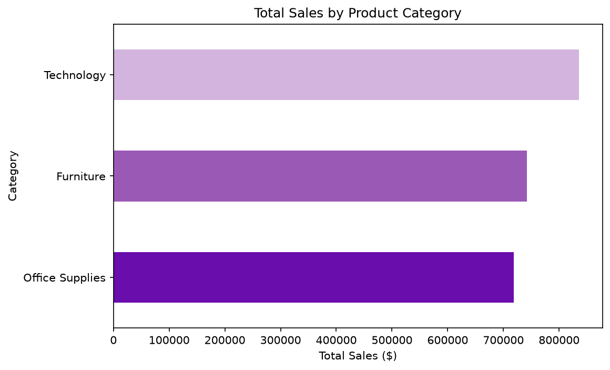
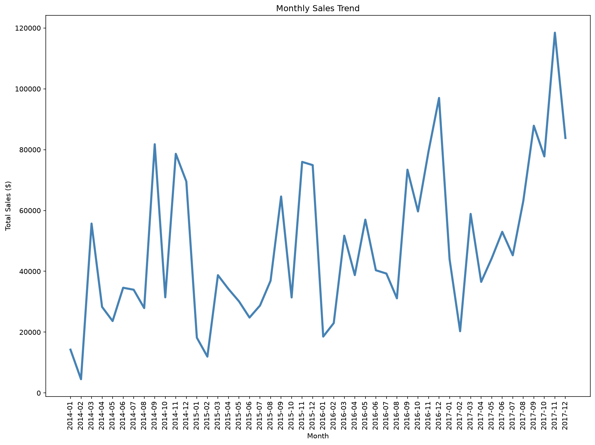
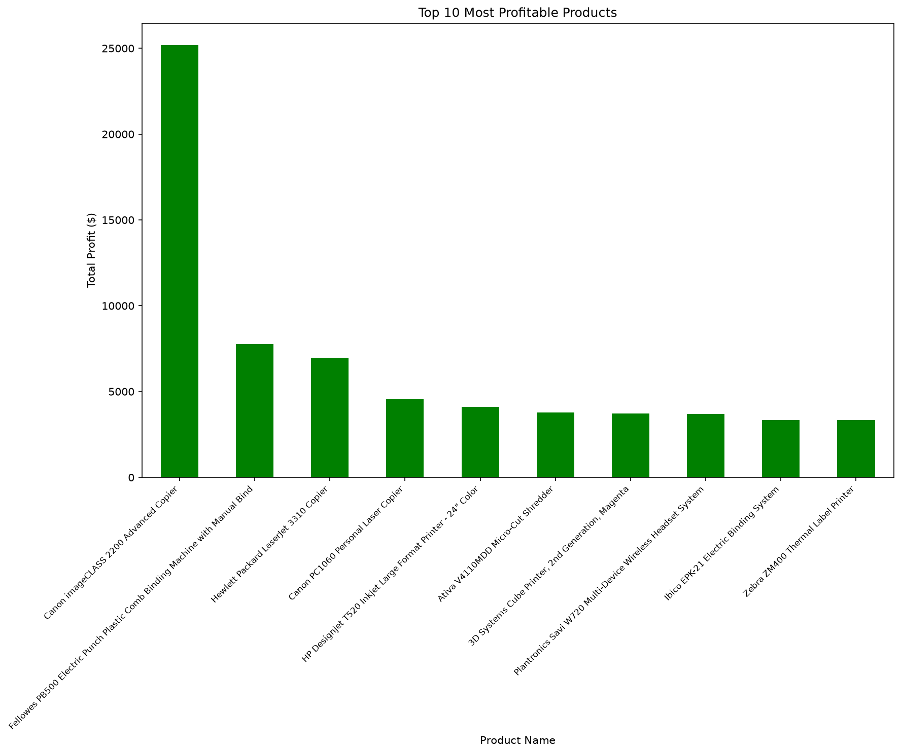
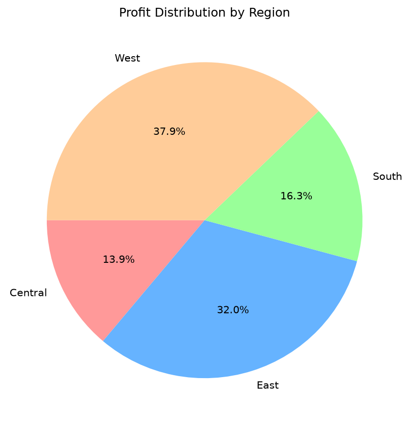

# Retail Store Sales Analysis — Business Performance Dashboard

An analysis of multi-year retail sales data, identifying top-performing products, seasonal trends, and regional profit distribution to surface the patterns that matter most to sales strategy.

**Tools:** Python · Pandas · Matplotlib · Seaborn

---

## Project overview

Using the Superstore dataset (9,994 transactions spanning 2014–2017), this project investigates which product categories, months, products, and regions actually drive revenue and profit — not just what sold, but why certain categories, periods, and regions consistently outperformed others.

## Key findings

1. **Technology is the highest-revenue category**, generating $836,154 in total sales — ahead of Furniture ($741,999) and Office Supplies ($719,047).
2. **Sales peak sharply in November and December** ($352,461 and $325,293 respectively), well above every other month — a clear seasonal pattern indicating strong holiday demand and an opportunity for targeted Q4 promotions.
3. **A small number of products drive disproportionate profit.** The top 10 products by profit account for 23.2% of total profit across the entire dataset — prioritizing these SKUs in inventory and marketing carries outsized impact relative to their share of the catalog.
4. **The West region generates the largest profit share** (37.9% of total profit), while the **Central region underperforms relative to its size** — it has the third-highest transaction volume of the four regions, but generates the least profit of any region, even less than the South, which has fewer transactions than Central.

## Chart previews

**Total sales by category**

**Monthly sales trend**

**Top 10 most profitable products**

**Profit distribution by region**

## How to view

- The full analysis is in `retail_sales_analysis.md` (exported from the original Jupyter notebook), readable directly on GitHub.
- To run it yourself: place `Superstore.csv` in the same folder, then run the notebook top to bottom in Jupyter. Requires `pandas`, `matplotlib`, and `seaborn`.
