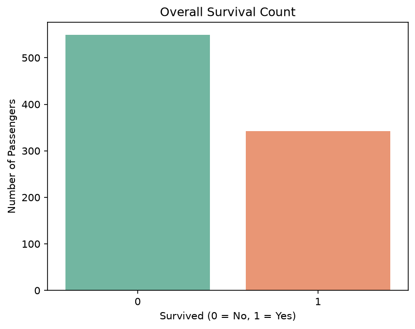
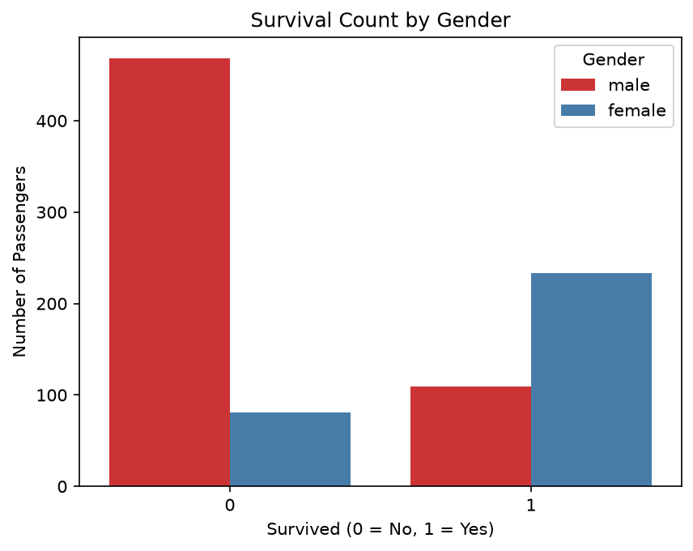
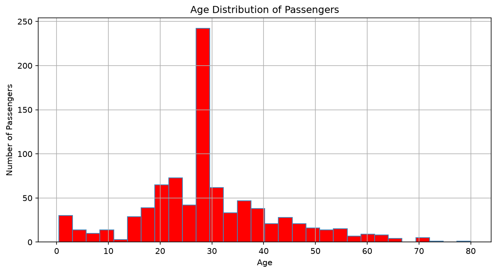
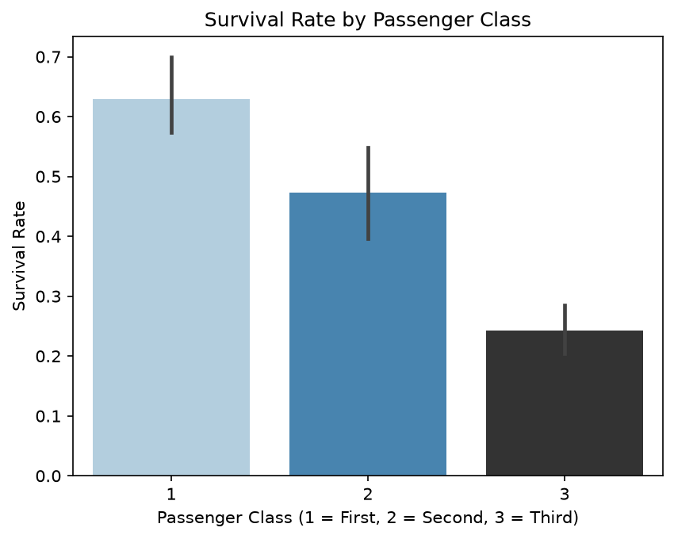
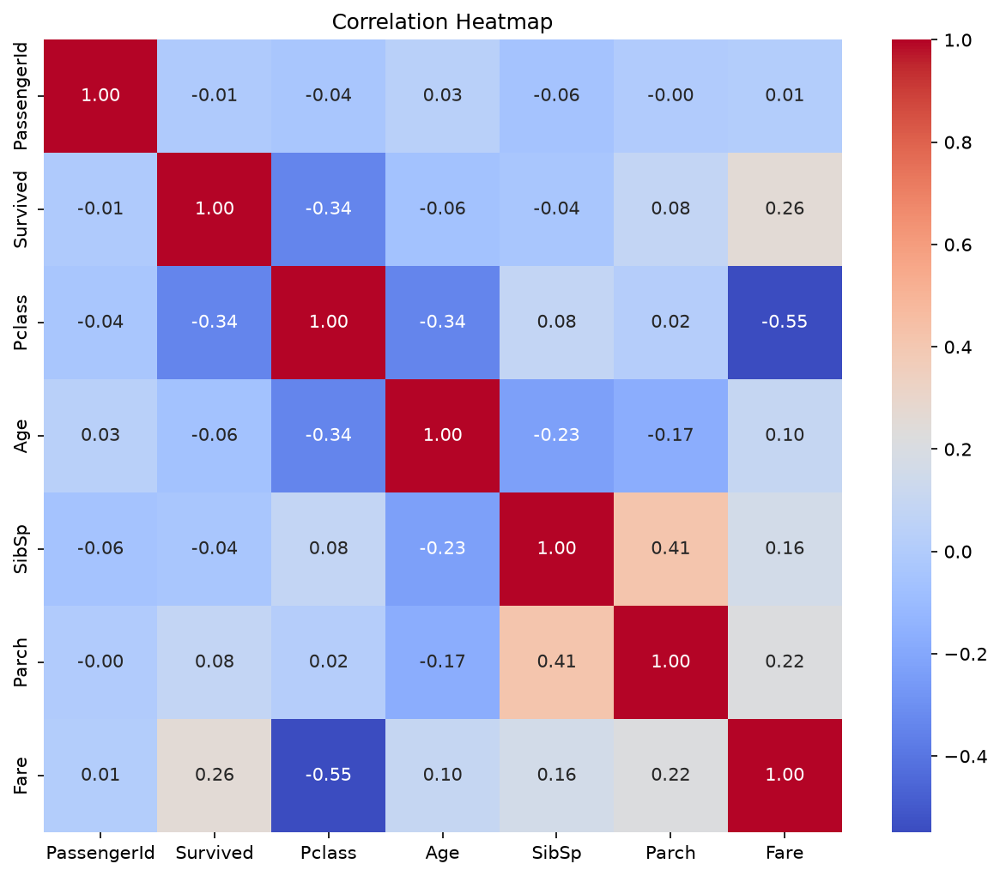
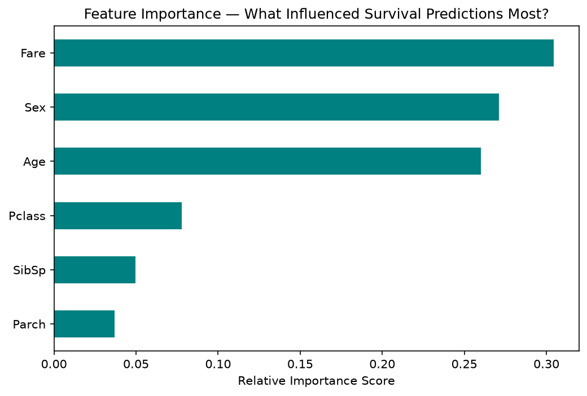

# Titanic Survival Analysis & Prediction Model

An end-to-end exploration of the Titanic passenger dataset — from cleaning and visualizing survival patterns through to building and evaluating a predictive model.

**Tools:** Python · Pandas · NumPy · Matplotlib · Seaborn · Scikit-learn

---

## Project overview

Using the standard 891-passenger Titanic dataset, this project investigates what actually predicted survival — gender, passenger class, age, and fare — before using those same features to train a Random Forest classifier and test whether the patterns found in exploration actually hold up as predictive signal.

## Data cleaning

- **Age** — 177 missing values (19.9% of rows), filled with the median age (28), chosen over the mean since it's less sensitive to outliers.
- **Cabin** — dropped entirely; 687 of 891 values were missing (77.1%), too sparse to meaningfully impute or use.
- **Embarked** — 2 missing values, filled with the most common port of embarkation.

## Key findings

1. **Gender was the strongest survival factor.** Female passengers survived at 74.2%, compared to 18.9% for male passengers — consistent with "women and children first" evacuation protocol.
2. **Passenger class strongly influenced survival.** First-class passengers survived at 63.0%, second-class at 47.3%, and third-class at just 24.2% — reflecting unequal access to lifeboats.
3. **Most passengers were between 20 and 40 years old**, with a median age of 28.
4. **Fare and survival are positively correlated** (r = 0.26) — passengers who paid more, typically first-class, were more likely to survive. The relationship is real but moderate, not a dominant driver on its own.

## Model

A Random Forest Classifier (100 estimators) was trained on six features — `Pclass`, `Sex`, `Age`, `SibSp`, `Parch`, `Fare` — using an 80/20 train-test split. `Name`, `Ticket`, and `PassengerId` were excluded as unique identifiers with no predictive value.

**Result:** ~80% accuracy on unseen test data.

**Feature importance:** Fare, Sex, and Age were the three most influential features, sitting close together in importance. Pclass contributed meaningfully but at a clearly lower level than the top three, with SibSp and Parch contributing the least.

## Chart previews

**Overall survival count**

**Survival by gender**

**Age distribution**

**Survival rate by passenger class**

**Correlation heatmap**

**Feature importance**

## How to view

- The full analysis and model-building process is in `Titanic_eda.md` (exported from the original Jupyter notebook), readable directly on GitHub.
- To run it yourself: place the standard Titanic dataset (`titanic.csv`, available from Kaggle's Titanic competition) in the same folder, then run the notebook top to bottom in Jupyter. Requires `pandas`, `numpy`, `matplotlib`, `seaborn`, and `scikit-learn`.
